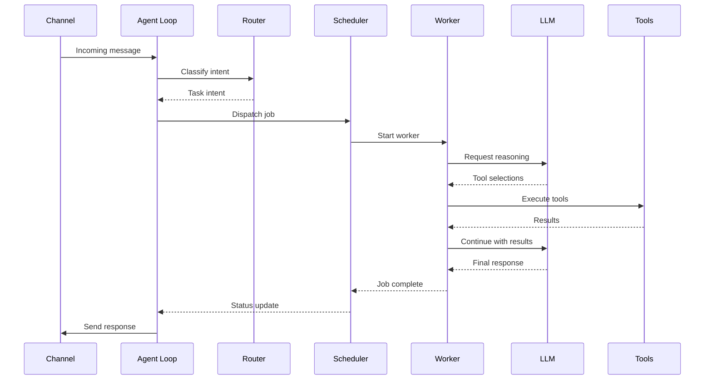
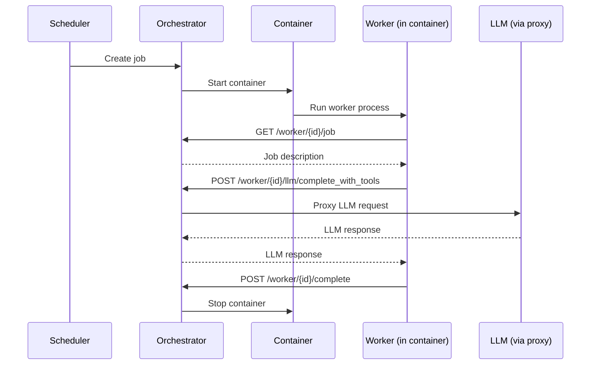

## Architecture Overview

IronClaw uses a modular architecture with clear separation of concerns. The main components communicate through well-defined interfaces:

```
┌────────────────────────────────────────────────────────────────┐
│                          Channels                              │
│  ┌──────┐  ┌──────┐   ┌─────────────┐  ┌─────────────┐         │
│  │ REPL │  │ HTTP │   │WASM Channels│  │ Web Gateway │         │
│  └──┬───┘  └──┬───┘   └──────┬──────┘  │ (SSE + WS)  │         │
│     │         │              │         └──────┬──────┘         │
│     └─────────┴──────────────┴────────────────┘                │
│                              │                                 │
│                    ┌─────────▼─────────┐                       │
│                    │    Agent Loop     │  Intent routing       │
│                    └────┬──────────┬───┘                       │
│                         │          │                           │
│              ┌──────────▼────┐  ┌──▼───────────────┐           │
│              │  Scheduler    │  │ Routines Engine  │           │
│              │(parallel jobs)│  │(cron, event, wh) │           │
│              └──────┬────────┘  └────────┬─────────┘           │
│                     │                    │                     │
│       ┌─────────────┼────────────────────┘                     │
│       │             │                                          │
│   ┌───▼─────┐  ┌────▼────────────────┐                         │
│   │ Local   │  │    Orchestrator     │                         │
│   │Workers  │  │  ┌───────────────┐  │                         │
│   │(in-proc)│  │  │ Docker Sandbox│  │                         │
│   └───┬─────┘  │  │   Containers  │  │                         │
│       │        │  │ ┌───────────┐ │  │                         │
│       │        │  │ │Worker / CC│ │  │                         │
│       │        │  │ └───────────┘ │  │                         │
│       │        │  └───────────────┘  │                         │
│       │        └─────────┬───────────┘                         │
│       └──────────────────┤                                     │
│                          │                                     │
│              ┌───────────▼──────────┐                          │
│              │    Tool Registry     │                          │
│              │  Built-in, MCP, WASM │                          │
│              └──────────────────────┘                          │
└────────────────────────────────────────────────────────────────┘
```

## Core Components

### Agent Loop

<Info>**Source**: `src/agent/agent_loop.rs`</Info>

The Agent Loop is the heart of IronClaw, coordinating all components and handling the main event loop. It:

- Receives messages from all connected channels
- Routes user intent (command, query, task) through the Router
- Manages session state and conversation context
- Coordinates with the Scheduler for parallel job execution
- Handles system commands (job control, memory operations)
- Triggers lifecycle hooks at key events

**Key Responsibilities**:

- Message dispatch from channels
- Intent classification and routing
- Session and context management
- Heartbeat coordination for background tasks
- Self-repair for stuck operations
- Hygiene checks for context cleanup

### Router

<Info>**Source**: `src/agent/router.rs`</Info>

The Router classifies incoming user messages to determine the appropriate handling path:

- **Command**: System commands like `/status`, `/jobs`, `/stop`
- **Query**: Information requests that can be answered from memory
- **Task**: Actions requiring tool execution or LLM reasoning

Routing uses the cheap LLM (if configured) to minimize costs for classification.

### Scheduler

<Info>**Source**: `src/agent/scheduler.rs`</Info>

The Scheduler manages parallel job execution with the following features:

**Job Management**:
- Create and dispatch jobs with metadata
- Track running jobs with unique UUIDs
- Enforce max parallel job limits
- Stop and cancel jobs on demand

**Worker Coordination**:
- Spawn worker tasks for each job
- Send control messages (Start, Stop, Ping, UserMessage)
- Monitor worker health and status
- Clean up completed jobs

**Subtask Execution**:
- Run background tasks (tool execution, async operations)
- Track subtask handles separately from main jobs
- Wait for subtask completion with timeouts

**SSE Broadcasting**:
- Stream job events to connected web clients
- Real-time updates for job status changes
- Tool execution progress notifications

### Worker

<Info>**Source**: `src/agent/worker.rs`</Info>

Workers execute individual jobs using LLM reasoning and tool calls:

**Execution Loop**:
1. Build reasoning context from job description and history
2. Call LLM to get action plan (optional) or tool selections
3. Execute selected tools in parallel
4. Add results to conversation history
5. Repeat until task completion or max iterations reached

**Features**:
- Planning mode for complex tasks (optional)
- Parallel tool execution for efficiency
- Rate limiting per tool
- Approval requests for sensitive operations
- Tool output streaming to SSE clients
- Automatic persistence of job events and LLM calls

**Safety Controls**:
- Tool output sanitization before LLM injection
- Prompt injection defense on external content
- Cost tracking for LLM calls
- Timeout enforcement

### Orchestrator

<Info>**Source**: `src/orchestrator/mod.rs`, `src/orchestrator/api.rs`</Info>

The Orchestrator manages Docker sandbox containers for isolated job execution:

**Internal API** (default port 50051):
- `/worker/{id}/job` - Get job description
- `/worker/{id}/llm/complete` - Proxy LLM requests
- `/worker/{id}/llm/complete_with_tools` - Proxy tool-enabled LLM calls
- `/worker/{id}/credentials` - Retrieve granted secrets
- `/worker/{id}/status` - Report worker status
- `/worker/{id}/complete` - Mark job completion
- `/worker/{id}/event` - Send job events (SSE broadcast)
- `/worker/{id}/prompt` - Poll for follow-up prompts

**Security**:
- Per-job bearer token authentication (constant-time comparison)
- Credential grants scoped to specific secrets
- Token revocation on container cleanup
- Platform-specific bind address (loopback on macOS/Windows, bridge on Linux)

**Container Lifecycle**:
- Create containers with isolated network and filesystem
- Configure HTTP proxy for allowlisted egress
- Inject per-job environment variables
- Monitor container status and logs
- Force stop containers on timeout
- Auto-remove containers on completion

### Channels

<Info>**Source**: `src/channels/`</Info>

Channels provide multiple interfaces for interacting with IronClaw:

<CardGroup cols={2}>
  <Card title="REPL" icon="terminal">
    Command-line interface for interactive use. Supports rich text display, job control, and status commands.
  </Card>
  
  <Card title="HTTP Webhook" icon="webhook">
    Receive messages via HTTP POST with shared secret authentication. Rate-limited to 60 requests/minute.
  </Card>
  
  <Card title="WASM Channels" icon="cube">
    Pluggable channels (Telegram, Slack, Discord) compiled to WebAssembly. Hot-loadable without restart.
  </Card>
  
  <Card title="Web Gateway" icon="browser">
    Browser UI with real-time SSE/WebSocket streaming. Authenticated via bearer token, CORS-protected.
  </Card>
</CardGroup>

All channels send messages to the Agent Loop through a unified `ChannelManager` abstraction.

### Tool Registry

<Info>**Source**: `src/tools/mod.rs`</Info>

The Tool Registry manages all available tools:

**Tool Types**:
- **Built-in**: Native Rust implementations (HTTP, file operations, shell commands)
- **WASM**: Sandboxed tools with capability-based permissions
- **MCP**: External tools via Model Context Protocol servers

**Features**:
- Dynamic tool registration and unregistration
- Tool metadata (name, description, parameters)
- Per-tool rate limiting
- Approval requirements for sensitive tools
- Tool execution with timeout and error handling

### Workspace

<Info>**Source**: `src/workspace/`</Info>

The Workspace provides persistent memory using hybrid search:

**Storage**:
- Path-based filesystem for notes and context
- Full-text search using PostgreSQL
- Vector search using pgvector extension
- Reciprocal Rank Fusion for hybrid results

**Content Types**:
- Conversation summaries
- User preferences and identity
- Long-term facts and knowledge
- Project documentation
- Tool outputs worth remembering

### Safety Layer

<Info>**Source**: `src/safety/`</Info>

The Safety Layer provides defense against prompt injection and data exfiltration:

**Protections**:
- Pattern-based injection detection
- Content sanitization and escaping
- Policy rules (Block, Warn, Review, Sanitize)
- Tool output wrapping for safe LLM context
- Leak detection for secrets in requests/responses

### Routines Engine

<Info>**Source**: `src/agent/routine_engine.rs`</Info>

The Routines Engine enables background automation:

**Routine Types**:
- **Cron**: Scheduled execution on cron expressions
- **Event**: Triggered by lifecycle events (startup, job completion, etc.)
- **Webhook**: HTTP callbacks from external services

**Features**:
- Persistent routine definitions in database
- Enable/disable without restart
- Last execution tracking
- Error handling and retry logic

## Data Flow

### Message Processing Flow



### Sandbox Job Execution



## Component Relationships

| Component | Dependencies | Provides To |
|-----------|--------------|-------------|
| **Agent Loop** | Scheduler, Router, Channels, Tools | All channels, Routines |
| **Router** | LLM Provider | Agent Loop |
| **Scheduler** | Context Manager, Tools, LLM | Agent Loop, Job Tools |
| **Worker** | Context Manager, Tools, LLM, Safety | Scheduler |
| **Orchestrator** | Container Manager, Token Store, LLM | Scheduler, Job Tools |
| **Tool Registry** | WASM Runtime, MCP Client | Worker, Agent Loop |
| **Workspace** | Database, Embeddings Provider | Worker, Agent Loop |
| **Safety Layer** | Leak Detector, Policy Rules | Worker, Tools |

<Check>The modular architecture allows components to be independently tested, replaced, or extended without affecting other parts of the system.</Check>
